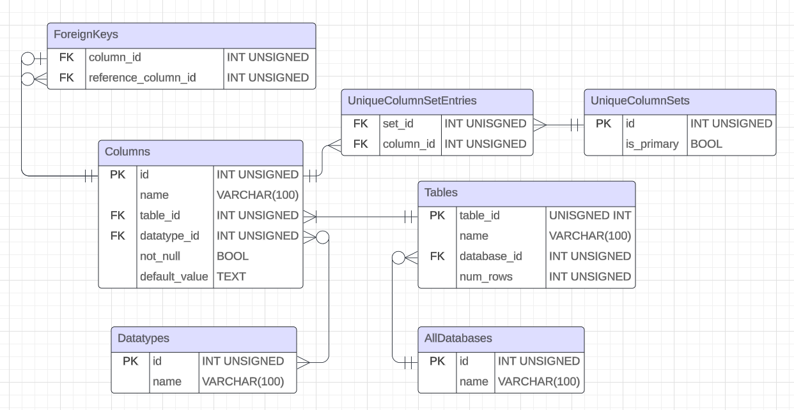

# Super Naive Text-to-SQL Engine

Built for BYU's CS 452 course.

### The Database

Purpose: to store database schemas. (It's a database database. Why not.)



### Text-to-SQL

#### Example queries

Successful:

```
>>> For each table, list the datatypes that are not used by that table.
Executing SQL: SELECT name FROM Datatypes;
Executing SQL: SELECT table_id, datatype_id FROM Columns;
The datatypes not used by each table are as follows:

1. **Tables**: TEXT, VARCHAR(100)
2. **Datatypes**: INT UNSIGNED, TEXT, VARCHAR(100)
3. **Columns**: INT UNSIGNED, TEXT, VARCHAR(100)
4. **ForeignKeys**: TEXT, VARCHAR(100)
5. **UniqueColumnSets**: INT UNSIGNED, TEXT, VARCHAR(100)
6. **UniqueColumnSetEntries**: INT UNSIGNED, TEXT, VARCHAR(100)
```

Somewhat less successful:

```
>>> How many foreign keys are in the Tables and Columns tables?
Executing SQL: SELECT COUNT(*) AS foreign_key_count FROM ForeignKeys;
Executing SQL: SELECT COUNT(*) AS foreign_key_count FROM Columns WHERE table_id IN (SELECT id FROM Tables);
There are 7 foreign keys in the ForeignKeys table, and 20 foreign keys related to the Columns table that are associated with the Tables.
```

See below for other examples.

#### Prompting Strategies

I tried zero-shot and single-domain, and didn't notice much of a difference between them unless I was asking nearly the same question as in the example. Understanding the question isn't what it struggles with (unless I accidentally ask a fundamentally ambiguous question... serves me right for making a database database). The problem seems to be in avoiding what are essentially typos. For example, it will occasionally try to join incompatible types, like `Tables.id=Columns.id`, which obviously isn't meaningful.

### Other Examples

#### Correct

```
>>> How many tables have at least one column whose datatype name is VARCHAR(100)?
Executing SQL: SELECT COUNT(DISTINCT t.id) AS num_tables FROM Tables t JOIN Columns c ON t.id = c.table_id JOIN Datatypes d ON c.datatype_id = d.id WHERE d.name = 'VARCHAR(100)';
There are 4 tables that have at least one column with the datatype name VARCHAR(100).
```

```
>>> Which columns are not part of a unique column set?
Executing SQL: SELECT c.name AS column_name, t.name AS table_name 
FROM Columns c 
JOIN Tables t ON c.table_id = t.id 
WHERE c.id NOT IN (SELECT column_id FROM UniqueColumnSetEntries);

The columns that are not part of a unique column set are:
- `datatype_id` (Table: Columns)
- `not_null` (Table: Columns)
- `default_value` (Table: Columns)
- `name` (Table: Datatypes)
- `num_rows` (Table: Tables)
- `is_primary` (Table: UniqueColumnSets)
```

```
>>> Add a new datatype called "john"
Executing SQL: INSERT INTO Datatypes (name) VALUES ('john')
It looks like the `id` field in the `Datatypes` table requires a value to be provided since it doesn't auto-increment. Would you like me to specify an `id` value when adding the new datatype? If yes, please provide a value.

>>> Set the id to whatever makes the most sense
Executing SQL: SELECT IFNULL(MAX(id), 0) + 1 AS next_id FROM Datatypes;
Executing SQL: INSERT INTO Datatypes (id, name) VALUES (7, 'john')
The datatype "john" has been successfully added with an ID of 7.
```

```
>>> Change the table name column to a TEXT datatype.
The datatype for the "column" table is not specified accurately in the schema you provided. The "Columns" table does not have a distinct "column" name but consists of columns like "id," "name," "table_id," and so on.
Could you please clarify which column you want to change to TEXT datatype, or do you mean adding a new column with this datatype?

>>> The tables table has a column called name. That's the column to change.
Executing SQL: ALTER TABLE Tables MODIFY name TEXT;
The error occurred because the "name" column in the "Tables" table is currently defined as part of a unique constraint. This means to change it to a TEXT datatype, we need to first remove the unique constraint and then modify the datatype.
Would you like me to proceed with this approach?

>>> Yes, but then add the unique constraint again afterward.
Executing SQL: ALTER TABLE Tables DROP INDEX name;
Executing SQL: ALTER TABLE Tables MODIFY name TEXT;
Executing SQL: ALTER TABLE Tables ADD UNIQUE (name, database_id);
To add a unique constraint on a TEXT column, we need to specify a prefix length. Since MySQL requires this for TEXT columns used in unique indexes, we will need to set a specific length for the index.
How many characters would you like to use as the prefix length for the unique constraint on the "name" column?

>>> I'm not sure, what's the prefix used for?
A prefix length in the context of a unique constraint for a TEXT column specifies how many characters should be considered for uniqueness. This means that if two entries in the "name" column start with the same specified number of characters, they will be treated as duplicates and not allowed in the table.
Using a smaller prefix length allows for more flexibility if you have many similar names, but could also increase the risk of collisions (i.e., unintended duplicates). A typical choice might be between 100 to 255 characters, depending on your data's expected variability.
How many characters would you like to use for the prefix length?

>>> Let's say 100.
Executing SQL: ALTER TABLE Tables ADD UNIQUE (name(100), database_id);
The "name" column has been successfully changed to TEXT datatype, and the unique constraint has been re-added with a prefix length of 100 characters. If you need anything else, just let me know!
```

#### Incorrect

```
>>> Which tables contain at least two primary key columns?
Executing SQL: SELECT t.name FROM Tables t JOIN UniqueColumnSetEntries ue ON t.id = ue.column_id JOIN UniqueColumnSets us ON ue.set_id = us.id WHERE us.is_primary = TRUE GROUP BY t.id HAVING COUNT(ue.column_id) >= 2;
There are no tables in the database that contain at least two primary key columns.
```

#### I mean, it's not exactly *wrong...*

```
>>> How many foreign keys does the ForeignKeys table have?
Executing SQL: SELECT COUNT(*) FROM ForeignKeys;
The ForeignKeys table has a total of 7 foreign keys.
```